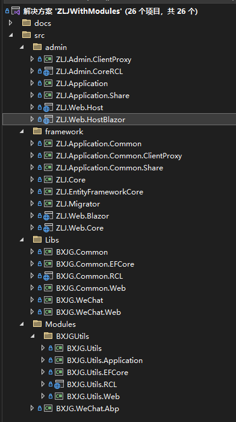
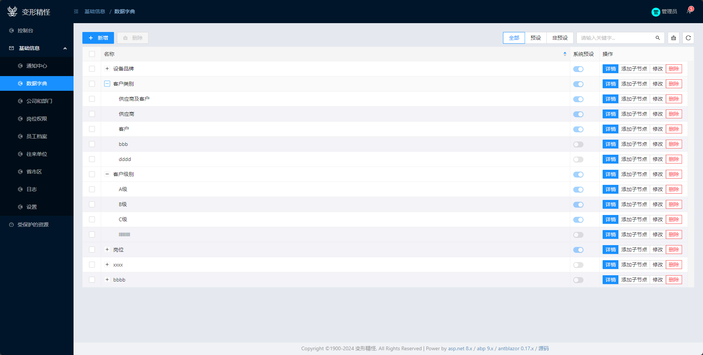
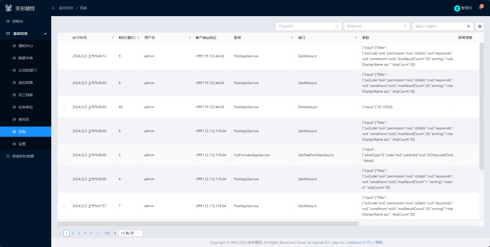
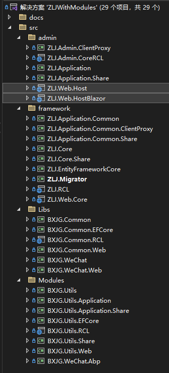

> 文档的更新速度一般木有代码的更新速度快，请注意核对代码和文档的最后更新时间。

# 简介
[abp9.x(一代)](https://aspnetboilerplate.com/)是基于asp.net core 8.x的快速开发框架，包含：用户角色权限、多租户、多语言、模块化、日志、后台任务、缓存、对象映射、通知、等等大部分项目都会用到的特征，完整特征请查看它的官方文档。本项目是基于它搭建，并增加了更多功能。
> 你应该先熟悉[abp9.x(一代)](https://aspnetboilerplate.com/)，因为本文档不会包含官方文档已存在的内容。

**此项目 = [abp9.x(一代)](https://aspnetboilerplate.com/) + 通用abp模块 + 帮助库 + blazor web app （auto模式，渐进式分离）** 

**通用abp模块** 
abp是模块化开发的，本项目按此方式创建了更多实用模块，如：通用文件附件、通用树形结构的数据、数据字典 等等，更多模块会在单独的章节中介绍。

**帮助库**
同“通用abp模块”一样，也是一些通用功能和帮助类方法，如：对字符串、时间、集合提供的扩展方法、以及类似微信小程序登录、支付等、中介类等通用功能。
“通用abp模块”依赖abp相关nuget包的，而“帮助库”不依赖abp的任何内容，它可以用于任何.net core的项目。

**blazor** 
[abp9.x(一代)](https://aspnetboilerplate.com/)默认是不支持blazor的，但本项目对blazor web app （auto模式，渐进式分离）做了集成，且默认使用[AntBlazor](https://ant-design-blazor.gitee.io/zh-CN/components/overview)，你可以修改代码替换成其它ui框架。

> **什么是渐进式分离？**  \
>blazor auto模式支持同一个项目中，部分页面用server模式，部分页面用client模式，也支持同一个页面中，部分组件用server模式，部分组件用client模式。
>
>基于此特征  \
>你开始使用server模式（它更简单）快速开发、交付项目，这个属于不分离方式。 \
>如果后续项目用户量变多，server模式扛不住了，你可以把部分页面变为client模式，也就是部分页面改为分离模式。
>用户量越多，你需要改的页面越多，相反用户量没有增加太多时，则不必继续修改。 
>
>此外server和client模式的组件或页面共存还有其它意义，项目中某些功能可能需要更高的实时性，用server模式比手动使用signalR更简单，而项目中的其它功能用client模式可以节省服务器资源\
>比如：在物联网系统中，设备列表页通常以server模式渲染，这样你可以实时查看和控制设备，而业务相关功能使用client模式更好。\
>再比如：在股票交易系统中，股票实时价格显示用server模式，其它普通业务功能使用client模式。

# 特征
1. [abp9.x(一代)](https://aspnetboilerplate.com/)的所有特征
1. blazor web app （auto模式，渐进式分离）集成
1. 基于[肉夹馍(静态编织)的aop](https://github.com/inversionhourglass/Rougamo)
1. 无限层次结构的数据的抽象。你可以轻松实现类似商品分类这种无限层次机构的功能。
1. 通用文件/附件。
1. 依赖权限。如：商品列表页访问权限，它依赖商品分类的查看权限，在授权商品列表查看权限时，会自动的一并授权商品分类的查看权限
1. 微信小程序登录/支付
1. 范围级事件总线。让界面元素之间不直接引用，也可以在一个组件变化时，另一个组件执行一些逻辑；也可以在租户级别触发事件，租户内的所有用户和其它实体做出反应。
1. 不遵循DDD，还是保持三层架构的方式
1. 增强的CrudAppService，增加批量操作；允许更细粒度的方法重写
1. 代码生成器（开发中...）
# 资源
在线demo地址：http://zlj.cqyuzuji.com:19911  \
视频：https://space.bilibili.com/314047707  \
博客：https://www.cnblogs.com/jionsoft/  \
源码：https://gitee.com/bxjg1987_admin/abp

预览图：

# 快速开始
## 环境
vs2022 .net8 sqlserver2012+
## 启动项目
1. 克隆项目
1. 双击ZLJWithModules.sln启动。
1. 修改ZLJ.Migrator和ZLJ.Web.Host中的appsettings.json中的数据库连接字符串
1. 将ZLJ.Migrator设为启动项，并启动它，
    1. 按y后回车，会自动生成并迁移数据库
    1. 再按y后回车，会自动插入演示数据
1. 将ZLJ.Web.Host(后端api)和ZLJ.Web.HostBlazor(blazor web app auto 模式)设为启动项，并启动它，登录信息（租户：default   账号：admin  密码：123qwe）

# 项目结构

分为公共库和主项目库，通常我们将公共库发布为nuget包，然后被主项目引用。
主项目就是具体项目，来个新项目时需要复制一份，多个具体项目都是引用相同公共库的nuget包
这样公共库可以一直升级下去。

若使用ZLJ.sln打开解决方案，主项目将以nuget包形式引用公共库，此时你需要添加：http://192.168.200.81:8087/v3/index.json
因为公共库经常在更新，所以我建了这个私有包源，你也可以将其打包后发布到nuget.org

## 公共库
1. Libs文件夹里是 **普通的.net core项目，与abp无关的** ，它包含一些公共帮助类、扩展方法等。
    1. BXJG.Common 最基础是帮助类，扩展方法等，可以被blazor前端引用
    1. BXJG.Common.EFCore 对efcore的一些扩展
    1. BXJG.Common.RCL 对razor（blazor）组件的扩展或抽象组件，可以被blazor前端引用。
    1. BXJG.Common.Web 跟web相关的一些扩展或帮助类方法
    1. BXJG.WeChat 微信小程序登录、支付
    1. BXJG.WeChat.Web 微信小程序中某些功能是跟web相关的，定义在这里的。
1. Modules此文件夹下是 **跟abp相关，但与具体项目无关的，都是按abp模块方式定义的** ，包含一些对abp的扩展，或一些公共功能，如：通用树的抽象、通用附件、同意crud应用服务的抽象等，注意这些库不能被blazor前端引用。
    1. BXJG.Utils 一些通用功能的实体、领域服务，以及对abp的一些扩展。
    1. BXJG.Utils.Application 一些通用功能的应用服务，以及对abp应用服务的扩展。如：抽象crud应用服务接口和抽象类
    1. BXJG.Utils.Application.Share 应用服务接口、dto和验证规则
    1. BXJG.Utils.EFCore 一些通用功能的ef相关定义在这里的，也包含一些对abp的ef相关的扩展
    1. BXJG.Utils.RCL 跟abp相关的blazor组件库，注意仅blazor的服务端部分才能引用它
    1. BXJG.Utils.Share 领域层中一些常量、辅助方法等，以类似BXJG.Utils.Application.Share这种库引用它，而不直接引用BXJG.Utils
    1. BXJG.Utils.Web 一些通用功能，跟web相关的，以及对abpweb相关扩展。
    1. BXJG.WeChat.Abp 让我们的微信库与abp的继承

## 主项目
1. **framework下是多个应用共享的库**，它是标准的abp模板项目中的库，然而，一个项目可能有多个应用（如：学校系统中，有教师端、学生端、家长、教务等），我们希望多个应用之间部分逻辑公用，但应用和UI层分开定义，各项目具体含义如下：
    1. ZLJ.Application.Common 公共应用服务实现，多个应用之间共享，前端不引用此库。
    1. ZLJ.Application.Common.ClientProxy 渐进式分离后期，部分页面使用httpclient访问后台api，多应用间的前端共享，后端不引用此库。
    1. ZLJ.Application.Common.Share 公共应用服务中，前端与后端共享的部分，通常包含接口、dto、验证规则、和其它共享功能。
    1. ZLJ.Core 这是abp项目模板的领域层，里面包含实体 领域服务 领域事件等，但注意，我们不打算使用DDD。
    1. ZLJ.Core.Share 领域层的某些对象可以需要在UI和应用服务层使用，通常这里定义些常量、枚举等，这样UI层不必引用领域层。
    1. ZLJ.EntityFrameworkCore 基于efcore的仓储
    1. ZLJ.Migrator 数据迁移
    1. ZLJ.RCL 在多个应用和前后端之间共享的，与blazor相关的公共功能。
    1. ZLJ.Web.Core 在ZLJ.WEB.Host和blazor host之间共享的，跟web相关的功能。
1.  **admin下是“后台管理应用”的应用服务和UI** ，若你有另一个应用，应该按类似的结构建立文件夹和项目。
    1. ZLJ.Admin.ClientProxy 渐进式分离后期，后台管理端在auto模式的客户端运行时，通过此库访问后端api
    1. ZLJ.Admin.CoreRCL 后台管理端的核心组件，它们可以使用任何渲染模式，它是auto模式的client部分。
    1. ZLJ.Application 后台管理端的应用服务
    1. ZLJ.Application.Share 后台管理中，前后端共享的功能，通常包含：后台管理端的应用服务接口、dto、验证规则等。
    1. ZLJ.Web.Host 承载后台管理端的webapi
    1. ZLJ.Web.HostBlazor 承载后台管理端的UI，它引用ZLJ.Admin.CoreRCL，它是auto模式的server部分。

## 各项目的引用关系
自己打开先看看哈。

# 关于DDD
不打算使用DDD

