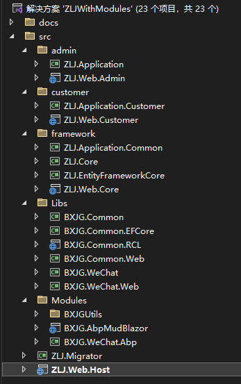

> 文档的更新速度一般木有代码的更新速度快，请注意核对代码和文档的最后更新时间。

# 简介
[abp8.x(一代)](https://aspnetboilerplate.com/)是基于asp.net core 7.x的快速开发框架，包含：用户角色权限、多租户、多语言、模块化、日志、后台任务、缓存、对象映射、通知、等等大部分项目都会用到的特征，完整特征请查看它的官方文档。本项目是基于它搭建，并增加了更多功能。
> 你应该先熟悉[abp8.x(一代)](https://aspnetboilerplate.com/)，因为本文档不会包含官方文档已存在的内容。

**此项目 = [abp8.x(一代)](https://aspnetboilerplate.com/) + 通用abp模块 + 帮助库 + blazor** 

**通用abp模块** 
abp是模块化开发的，本项目按此方式创建了更多实用模块，如：通用文件附件、通用树形结构的数据、数据字典 等等，更多模块会在单独的章节中介绍。

**帮助库**
同“通用abp模块”一样，也是一些通用功能和帮助类方法，如：对字符串、时间、集合提供的扩展方法、以及类似微信小程序登录、支付等、中介类等通用功能。
“通用abp模块”依赖abp相关nuget包的，而“帮助库”不依赖abp的任何内容，它可以用于任何.net core的项目。

**blazor** 
[abp8.x(一代)](https://aspnetboilerplate.com/)默认是不支持blazor的，但本项目对blazor server做了集成，且默认使用[Ant Design Blazor](https://antblazor.com/zh-CN/)，你可以修改代码替换成其它ui框架。

# 特征
1. [abp8.x(一代)](https://aspnetboilerplate.com/)的所有特征
1. blazor server集成
1. 基于[肉夹馍(静态编织)的aop](https://github.com/inversionhourglass/Rougamo)
1. 单体项目多应用支持。如：后台管理、供应商、客户服务 看作是3个应用，每个应用的用户不同、功能列表不同、登录页面和管理界面不同。
1. 无限层次结构的数据的抽象。你可以轻松实现类似商品分类这种无限层次机构的功能。
1. 通用文件/附件。
1. 依赖权限。如：商品列表页访问权限，它依赖商品分类的查看权限，在授权商品列表查看权限时，会自动的一并授权商品分类的查看权限
1. 微信小程序登录/支付
1. 范围级事件总线。让界面元素之间不直接引用，也可以在一个组件变化时，另一个组件执行一些逻辑；也可以在租户级别触发事件，租户内的所有用户和其它实体做出反应。
1. 不遵循DDD，还是保持三层架构的方式
1. 增强的CrudAppService，增加批量操作；允许更细粒度的方法重写
1. 动态条件过滤。
1. 代码生成器（开发中...）

# 快速开始
## 环境
vs2022 .net7 sqlserver2012+
## 启动项目
1. 克隆项目
1. 双击ZLJWithModules.sln启动。
1. 修改ZLJ.Migrator和ZLJ.Web.Host中的appsettings.json中的数据库连接字符串
1. 将ZLJ.Migrator设为启动项，并启动它，
    1. 按y后回车，会自动生成并迁移数据库
    1. 再按y后回车，会自动插入演示数据
1. 将ZLJ.Web.Host设为启动项，并启动它，会跳转到登录页面，租户：default   账号：admin      密码：123qwe

# 项目结构

分为公共库和主项目库，通常我们将公共库发布为nuget包，然后被主项目引用。
主项目就是具体项目，来个新项目时需要复制一份，多个具体项目都是引用相同公共库的nuget包
这样公共库可以一直升级下去。

若使用ZLJ.sln打开解决方案，主项目将以nuget包形式引用公共库，此时你需要添加：http://192.168.200.81:8087/v3/index.json
因为公共库经常在更新，所以我建了这个私有包源，你也可以将其打包后发布到nuget.org

## 公共库
1. Libs文件夹里是 **普通的.net core项目，与abp无关的** ，它包含一些公共帮助类、扩展方法等。
    1. BXJG.Common最基础是帮助类，扩展方法等
    1. BXJG.Common.EFCore对efcore的一些扩展
    1. BXJG.Common.RCL对razor（blazor）组件的扩展或抽象组件
    1. BXJG.Common.Web跟web相关的一些扩展或帮助类方法
    1. BXJG.WeChat微信小程序登录、支付
    1. BXJG.WeChat.Web微信小程序中某些功能是跟web相关的，定义在这里的。
1. Modules此文件夹下是 **跟abp相关，但与具体项目无关的，都是按abp模块方式定义的** ，包含一些对abp的扩展，或一些公共功能，如：通用树的抽象、通用附件、同意crud应用服务的抽象等
    1. BXJG.Utils 一些通用功能的实体、领域服务，以及对abp的一些扩展。
    1. BXJG.Utils.EFCore 一些通用功能的ef相关定义在这里的，也包含一些对abp的ef相关的扩展
    1. BXJG.Utils.Application 一些通用功能的应用服务，以及对abp应用服务的扩展。如：抽象crud应用服务接口和抽象类
    1. BXJG.Utils.Web 一些通用功能，跟web相关的，以及对abpweb相关扩展。
    1. BXJG.Utils.RCL 跟abp相关的blazor组件库，如：抽象组件AbpBaseComponent，它是个组件，里面定义了对abp常用属性的引用
    1. BXJG.AbpBlazor 与abp和AntBlazor相关的组件库，如：crud抽象组件
    1. BXJG.WeChat.Abp 让我们的微信库与abp的继承

## 主项目
1. framework下是标准的abp模板项目中的库，但由于我们是单体框架，多应用，所以ZLJ.Application.Common仅仅是公共的应用服务，里面存放所有应用共享的功能。注：ZLJ.Web.Core基本不用，不过也不能删；它在本项目中已经失去了原本的意义。
1. admin文件夹下是“后台管理应用”的应用服务（ZLJ.Application）和界面（ZLJ.Web.Admin）
1. customer同上，它是“客户服务应用”的应用服务（ZLJ.Application.Customer）和界面（ZLJ.Web.Customer）
1. ZLJ.Web.Host 它承载admin和custome这俩应用，也是我们的启动项目

## 各项目的引用关系
自己打开先看看哈。

