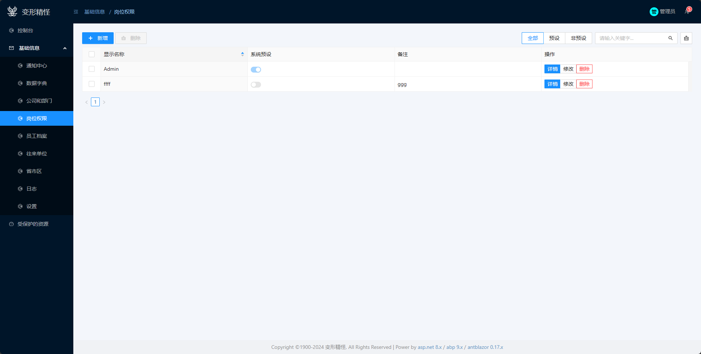

# 目前的实现
abp默认提供了全局通用hub，目前没有想那么深远，也仅针对此hub做设计。

由于前端是auto模式。server和wasm都使用signalR连接，这样编程更简单

BXJG.Utils.RCL中，CommonConnection，它使用scope注册到ioc，这样server模式时可用，wasm时自动成了单例。
它负责两个事：
建立signalR连接
处理abp的通知

由于wasm好像木有IHostApplicationLifetime，wasm好像也不支持IHostedSerrvice
所以还是在路由的cs代码中启动
另一个原因是assesstoken也是在ui中初始化的

最后处理常规通知
也是在路由的cs代码中

# 以下是乱七八糟的分析，

先看微软文档signalR，再看abp 的文档

abp实时客户端源码：
https://github.com/aspnetboilerplate/aspnetboilerplate/blob/252cc382c3e4d829d94ca8950f169b19ec0bbd00/src/Abp.Web.Resources/Abp/Framework/scripts/libs/abp.signalr-client.js#L4

abp的实时建立在signalR上的，通知是建立在abp的实时上的另一个模块

# 认识Hub

本文档仅说明实时部分。

由于我们使用的blazor，官方木有提供对应的实时客户端，所以需要自己实现。
参考上面abp的js实时客户端，它主要就是做了个signalR的连接，处理了重连、身份验证等..

signalR文档中有从hub外部给指定客户端发送消息
abp中文档没有提，需要参考基于signalR的通知实现内部源码应该有体现。

我们的api是独立服务， 前端是使用blazor auto另一个独立部署的程序，auto模式中以server运行的时候，和以wasm模式运行的时候，都是通过httpclient与后端api交互
实时应用同样使用这种模式，以server和wasm运行的时候，都通过signalR的.net客户端连接到api项目中的signalR的hub

signalR通过hub连接服务端和客户端，实现方法的互相调用，在客户端部分，是否使用事件总线不一定是必须的，但是通知模块使用事件总线是比较常见的。

服务端
服务端abp都弄好了，不用动

客户端
https://learn.microsoft.com/zh-cn/aspnet/core/signalr/dotnet-client?view=aspnetcore-8.0&tabs=visual-studio
安装包，配置连接就不说了
主要是连接的管理，一个连接对象 对应服务端的 一个hub终结点
一个项目可能有多个hub，每个hub中定义了供客户端调用的方法
可以简单类比一个hub对应一个controller，但每个hub都需要连接，因为通常是长连接
每个hub一个websocket实例，这个没测试过。gpt 千问 回到的都是每个hub一个websocket实例。

hub提供给客户端调用的方法是定义在每个hub上的
反过来客户端提供给服务端来调用的方法是与连接挂钩的

客户端中分散到各处的代码都有可能需要通过指定连接调用服务端的对应hub的方法
在生成之后，但是在启动连接之前使用 connection.On 定义中心调用的方法。 这说明无法在运行时添加方法？

通知如何触发事件的
   // Register to get notifications
        connection.on('getNotification', function (notification) {
            abp.event.trigger('abp.notifications.received', notification);
        });
https://github.com/aspnetboilerplate/aspnetboilerplate/blob/252cc382c3e4d829d94ca8950f169b19ec0bbd00/src/Abp.Web.Resources/Abp/Framework/scripts/libs/abp.signalr-client.js#L66

# 有必要从客户端调用服务端吗
通常客户端调用服务端可以走api，可以不用signalR客户端调用服务端。
这样客户端不用提供connection的引用，只要它存活即可。
若确实有这种场景，则需要保留连接对象。但是好像想象不到这种场景

# 强类型hub

服务端调用客户端时，可以强类型
https://learn.microsoft.com/zh-cn/aspnet/core/signalr/hubs?view=aspnetcore-8.0#strongly-typed-hubs
https://learn.microsoft.com/zh-cn/aspnet/core/signalr/hubcontext?view=aspnetcore-8.0#inject-a-strongly-typed-hubcontext

客户端部分
只要拿到连接引用，就可以注入委托
文档中有这句：在生成之后，但是在启动连接之前使用 connection.On 定义中心调用的方法。 这说明无法在运行时添加方法？
可能意味着不能在运行时动态注册被服务端调的委托

如何保留signalR的连接

server模式
类似CircuitHandler可以用scope来保持server连接状态
可以把对象注册为scope服务，然后从容器中拿
而且还支持ioc注册级联组件参数，这样组件很容易拿到连接对象

用上述方式后，客户端也同样从ioc中拿，组件可以通过级联拿连接

